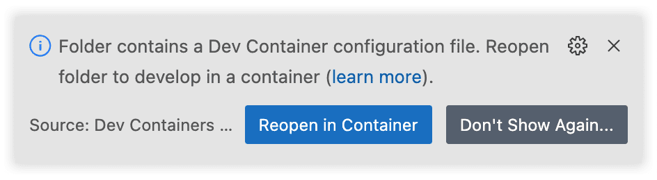

Docker Vercel CLI
=================

> Docker image to use Vercel cli without installing it

| CD / CI   | Status |
| --------- | ------ |
| Semaphore CI |  |
| CircleCI |  |

## Available architectures

+ linux/arm64
+ linux/arm/v6
+ linux/arm/v7

## Setup for development

Or

1. Install VSCode extension "Dev Containers"

2. Clone and open up the repository in VSCode, then, you should see the following notification:

3. Click on "Reopen in Container"

4. Enjoy! :smiling_face_with_heart_eyes:

## How to use

`$ docker run --rm -it sineverba/vercel-cli:1.5.0 vercel [COMMAND]`